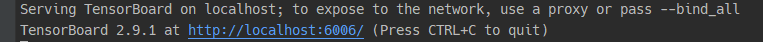
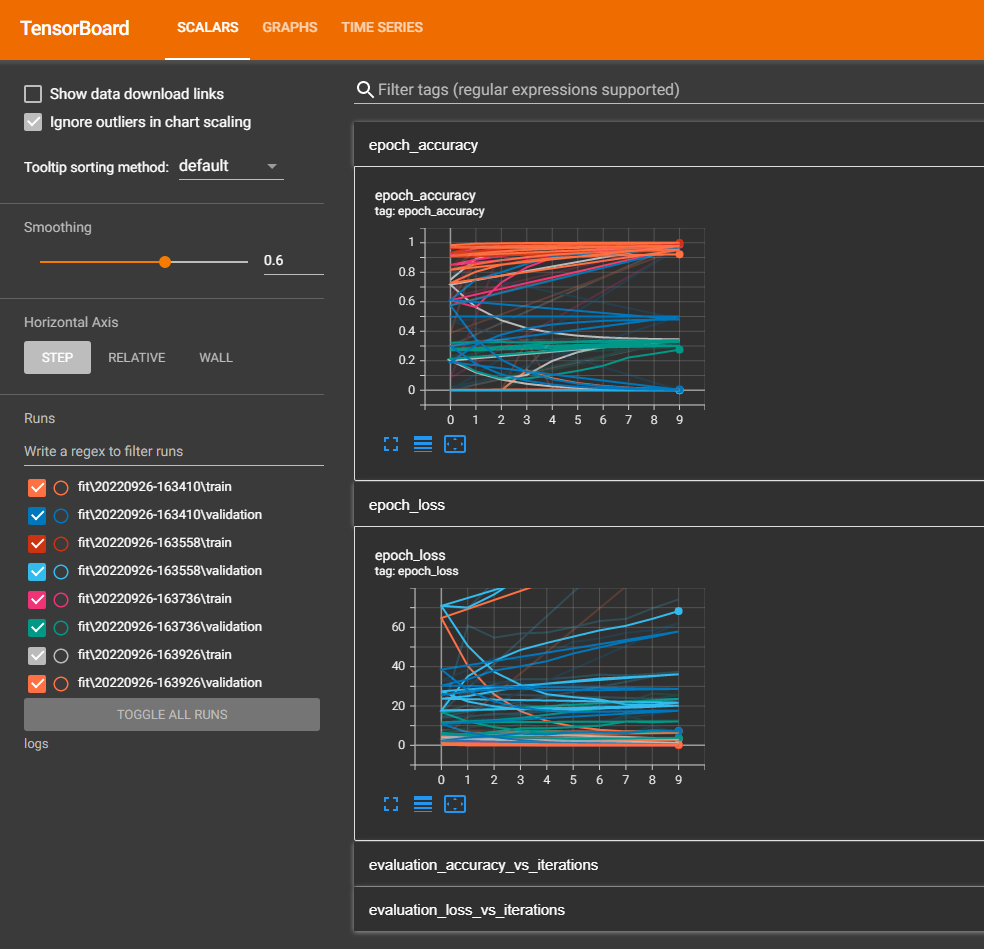
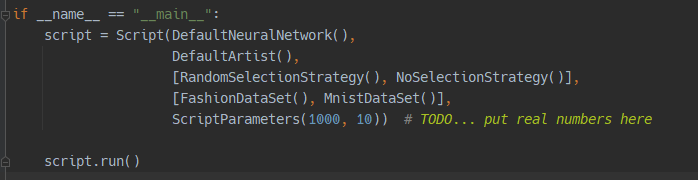

# 760-Replay-Strategies

## How to use TensorBoard:

Steps:
 - Install the Tensorboard library using pip: `pip install tensorboard` 
 - Use tensorboard to load the logs file, run in your command prompt: `tensorboard --logdir {path-to-logs}`

If you've opened your command prompt in the main project folder then you can use the relative path with the following command:

`tensorboard --logdir logs`

If it's working you should see the following output:

You can then either click on the link or open your browser and type it into the address bar which should load the tensorboard page:

## How to use Scripts

In main.py we are using Script objects to define which strategies we want to test and which models we want to test them on.
Scripts take five inputs as shown below:

- The neural network you want to use to run the tests with
- The artist that you want to use to output the results
- The list of strategies that you want to use (these are run separately)
- The datasets that you want to use (also run separately)
- The hyper-parameters to be used

In this example the script will run four different tests with both strategies attempting both datasets. It will also
use the default neural network and artist and run the tests with 1000 memories per task and 10 epochs 
(as defined by the script parameters).

Further explanation of each parameter will be discussed below:

### Neural Network

Currently available options:
- [DefaultNeuralNetwork](models/default_neural_network.py)

The default class is a 6 layer CNN with two convolutional layers, a pooling layer, a flattening layer, and two dense layers. 
It uses the 'adam optimizer', calculates predictions as well as the history, and saves log data to the logs file.
It takes the following optional arguments:
- num_filters_1 = 4 : The number of filters in the initial convolutional layer
- kernel_size_1 = (5, 5) : The shape of the kernel in the first convolutional layer
- input_shape = (28, 28, 1) : The shape of the inputs (generally images)
- max_pooling_shape = (2, 2) : The shape of the MaxPooling2D layer
- num_filters_2 = 8 : The number of filters in the second convolutional layer
- kernel_size_2 = (3, 3) : The shape of the kernel in the second convolutional layer
- activation_type = 'relu' : The activation type for the two convolutional layers and first dense layer
- dense_layer_size = 10 : The size of the last two dense layers

If you wish to use a different model then you can creat a new NeuralNetwork class. All NeuralNetworks must extend the 
abstract [NeuralNetwork](models/neural_network.py) class and implement the reset() and train_task().

### Artist

Currently available options:
- [DefaultArtist](art/default_artist.py)
- [PlottingArtist](art/plotting_artist.py)

The default artist currently is a stub and doesn't implement and plotting in the draw method. This is because plot 
creation for large runs is currently being handled by the tensorboard library.

The plotting artist can be used to create specific plots not covered by tensorboard, to do this plotting code must 
be placed into the artist's Draw() method.

If you wish to do something else with the output data then you can create a new Artist class. All Artists must extend 
the abstract [Artist](art/artist.py) class and implement the draw() and add_results() methods.

### Strategies

Currently available options:
- [NoSelectionStrategy](strategies/no_selection_strategy.py)
- [RandomSelectionStrategy](strategies/random_selection_strategy.py)
- [ForgettingMetricStrategy](strategies/forgetting/forgetting_selection_strategy.py)

Coming Soon!
- [NovelSelectionStrategy](strategies/novel_selection_strategy.py)

Strategies define the method used to select which memories should be kept in order to utilise replay to reduce 
catastrophic forgetting. NoSelectionStrategy simply returns no memories and RandomSelectionStrategy returns a random
selection. These are simply for use in comparison with our other strategies.

ForgettingNeuralSelection requires it's own [ForgettingNeuralNetwork](models/forgetting_neural_network.py) to be passed
in when first instantiated. If you wish to have it use a different NN for it's internal "forgetness" calculations then
that NN must output prediction values in it's [TaskResult](data/task_result.py).

Scripts take a list of strategies to test with but run each strategy separately and disconnected from the others. If 
you wish to test a mixture of strategies working in tandem then you will need to implement a new strategy class that 
implements that.

If you wish to create a new Strategy then you can make a new Strategy class. All Strategy classes must extend the 
abstract [SelectionStrategy](strategies/selection_strategy.py) class and implement the select_memories() methods.

### Datasets

Currently available options:
- [MnistDataSet](data/mnist_data_set.py)
- [FashionDataSet](data/fashion_data_set.py)

Datasets store data and handle the creation of [Task](data/task.py) objects. Currently all data must be of the shape
(28, 28, 1) as this is hardcoded in some areas. 

### Script Parameters

The [Script Parameter](scripts/script_parameters.py) object defines the value for the hyper-parameters used in the 
tests.

Currently available parameters are:
- Number of memories per task 
- Number of epochs per task

Note that changing the number of epochs will not change the number of epochs used by the 
[ForgettingNeuralNetwork](models/forgetting_neural_network.py).

